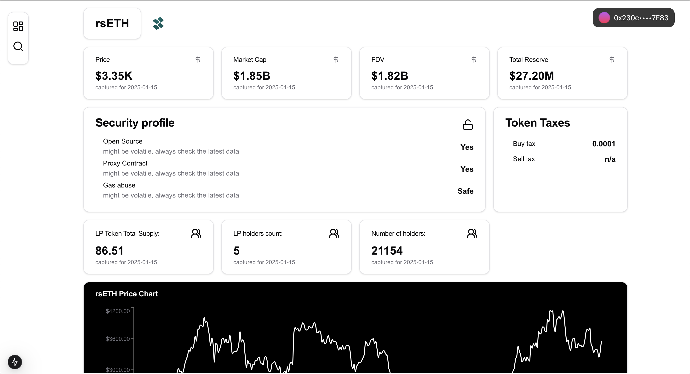

# Project Name
> DEX Token dasboard powered by coingecko and goplus
> Live demo link [_here_](https://tokensight-exercise.vercel.app/).

## Table of Contents
* [General Info](#general-information)
* [Technologies Used](#technologies-used)
* [Features](#features)
* [Screenshots](#screenshots)
* [Setup](#setup)
* [Areas for Improvement](#areas-for-improvement)

## General Information
- This project intends to solve searching and monitoring tokens issue

## Technologies Used
- Next.js
- TanStackQuery
- shadcn

## Features
List the ready features here:
- Search for existing tokens by smart-contract address
- Enjoy crucial data including Security and Price chart
- Share link for already found tokens with friends
- Mobile friendly!

## Screenshots

## Setup
`cd frontend`
Make sure that you've Node > 20
`npm install --force` or `npm install --legacy-peer-deps` to fetch necessary deps as we use `Next.js === 15.1`

## Areas for Improvement

Areas for improvement:
- Improve chart with range selection
- Add more data
- Add attractive banners with top tokens, latest tokens, popular pairs etc. That can improve user impression
